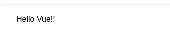

# Section 02: Basic Python Concepts
## Lesson overview
- What is Vue.js?
- Getting Started
- Declarative Rendering
- Handling User Input
- Conditionals and Loops
- Composing with Components
- Relation to Custom Elements
## What is Vue.js?
- VueJs is a progressive framework for building user.
- It can integrate into every project that isn' t built in the first place like angular.
- The core library is on the view layer only
## Getting Started
- Create `index.html`
```vue
<!DOCTYPE html>
<html lang="en">
<head>
    <meta charset="UTF-8">
    <title>test VueJS</title>
    <script src="https://unpkg.com/vue@next"></script>
    <style>
        .demo {
            font-family: sans-serif;
            border: 1px solid #eee;
            border-radius: 2px;
            padding: 20px 30px;
            margin-top: 1em;
            margin-bottom: 40px;
            user-select: none;
            overflow-x: auto;
        }
    </style>
</head>
<body>
<div id="hello-vue" class="demo">
  {{ message }}
</div>
<scripts>
const HelloVueApp = {
  data() {
    return {
      message: 'Hello Vue!!'
    }
  }
}
Vue.createApp(HelloVueApp).mount('#hello-vue')
</scripts>
</body>
</html>
```
- Open file with browser, we have result



## Installation
- Have 4 way to install VueJS
    - CDN
    - Download JavaScript files and host them yourself  
    - NPM
    - `vue-cli`
    
### Install with CDN
- For prototyping or learning purposes, you can use the latest version with:
```vue
<script src="https://unpkg.com/vue@next"></script>
```
- For production, we recommend linking to a specific version number and build to avoid unexpected breakage from newer versions
### Install with file JS
- Unpkg: https://unpkg.com/browse/vue@3.0.11/dist/
- Production: https://cdn.jsdelivr.net/npm/vue@next/dist/
### Install with NPM
- Use the npm for building large VueJS applications that need to incorporate multiple pack web packs to use.
```npm
$ npm install vue@next
```
- Notes: If you use in the linux environment, you don' t need to install VueJS into the root system, install them in Vue's application directories, if you want to use a global VueJS in system please see `vue-cli`
### Install with `vue-cli`
- Vue - cli is a great tool for creating projects, including your original settings, they provide features that vue - package can' t have as hot - reload.
- For Vue 3, you should use Vue CLI v4.5 available on npm as @vue/cli. To upgrade, you need to reinstall the latest version of @vue/cli globally:
```shell
yarn global add @vue/cli
# OR
npm install -g @vue/cli
```
- Notes: if using root shell, please add sudo prefix in front command
## Declarative Rendering
### Binding DOM
- The following example, rõ data by vuejs. This is simple application using vuejs created through `Vue.createApp()`
- Vue using `mount()` for connect and declare DOM element -> render data
```html
<div id="counter">
  Counter: {{ counter }}
</div>
```
```vue
const Counter = {
  data() {
    return {
      counter: 0
    }
  }
}
Vue.createApp(Counter).mount('#counter')
```
### Binding Attributes
## Handling User Input
## Conditionals and Loops
## Composing with Components
## Relation to Custom Elements
