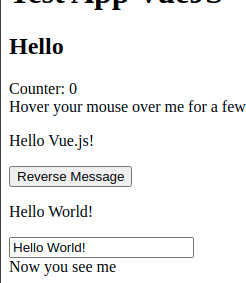

# Section 02: Basic VueJS Concepts
## Lesson overview
- What is Vue.js?
- Getting Started
- Declarative Rendering
- Handling User Input
- Conditionals and Loops
- Composing with Components
- Relation to Custom Elements
## What is Vue.js?
- VueJs is a progressive framework for building user.
- It can integrate into every project that isn' t built in the first place like angular.
- The core library is on the view layer only
## Getting Started
- Create `index.html`
```vue
<!DOCTYPE html>
<html lang="en">
<head>
    <meta charset="UTF-8">
    <title>test VueJS</title>
    <script src="https://unpkg.com/vue@next"></script>
    <style>
        .demo {
            font-family: sans-serif;
            border: 1px solid #eee;
            border-radius: 2px;
            padding: 20px 30px;
            margin-top: 1em;
            margin-bottom: 40px;
            user-select: none;
            overflow-x: auto;
        }
    </style>
</head>
<body>
<div id="hello-vue" class="demo">
  {{ message }}
</div>
<scripts>
const HelloVueApp = {
  data() {
    return {
      message: 'Hello Vue!!'
    }
  }
}
Vue.createApp(HelloVueApp).mount('#hello-vue')
</scripts>
</body>
</html>
```
- Open file with browser, we have result


## Installation
- Have 4 way to install VueJS
    - CDN
    - Download JavaScript files and host them yourself  
    - NPM
    - `vue-cli`
    
### Install with CDN
- For prototyping or learning purposes, you can use the latest version with:
```vue
<script src="https://unpkg.com/vue@next"></script>
```
- For production, we recommend linking to a specific version number and build to avoid unexpected breakage from newer versions
### Install with file JS
- Unpkg: https://unpkg.com/browse/vue@3.0.11/dist/
- Production: https://cdn.jsdelivr.net/npm/vue@next/dist/
### Install with NPM
- Use the npm for building large VueJS applications that need to incorporate multiple pack web packs to use.
```npm
$ npm install vue@next
```
- Notes: If you use in the linux environment, you don' t need to install VueJS into the root system, install them in Vue's application directories, if you want to use a global VueJS in system please see `vue-cli`
### Install with `vue-cli`
- Vue - cli is a great tool for creating projects, including your original settings, they provide features that vue - package can' t have as hot - reload.
- For Vue 3, you should use Vue CLI v4.5 available on npm as @vue/cli. To upgrade, you need to reinstall the latest version of @vue/cli globally:
```shell
yarn global add @vue/cli
# OR
npm install -g @vue/cli
```
- Notes: if using root shell, please add sudo prefix in front command
## Declarative Rendering
### Binding DOM
- The following example, rõ data by vuejs. This is simple application using vuejs created through `Vue.createApp()`
- Vue using `mount()` for connect and declare DOM element -> render data
```html
<div id="counter">
  Counter: {{ counter }}
</div>
```
```vue
const Counter = {
  data() {
    return {
      counter: 0
    }
  }
}
Vue.createApp(Counter).mount('#counter')
```
- Open file with browser, we have result


### Binding Attributes
- directives also known as attributes do not exist in html, they are added by vue to interact with the DOM. The symbol is prefixed with `v-name`
```vue
<div id="bind-attribute">
  <span v-bind:title="message">
    Hover your mouse over me for a few seconds to see my dynamically bound
    title!
  </span>
</div>
```
```vue
const AttributeBinding = {
  data() {
    return {
      message: 'You loaded this page on ' + new Date().toLocaleString()
    }
  }
}
Vue.createApp(AttributeBinding).mount('#bind-attribute'
```
- Result 


## Handling User Input
### Handling User Event
- To let users interact with your app, we can use the `v-on` directive to attach event listeners that invoke methods on our instances:
- the instance App of Vue already has `methods` to catch events that work them
```vue
<div id="event-handling">
  <p>{{ message }}</p>
  <button v-on:click="reverseMessage">Reverse Message</button>
</div>
```
```vue
const EventHandling = {
  data() {
    return {
      message: 'Hello Vue.js!'
    }
  },
  methods: {
    reverseMessage() {
      this.message = this.message
        .split('')
        .reverse()
        .join('')
    }
  }
}

Vue.createApp(EventHandling).mount('#event-handling')
```
- Result 


  


### Handling User Input Data
- We update the state of our app without touching the DOM - all DOM manipulations are handled by Vue, and the code you write is focused on the underlying logic.
- Vue also provides the v-model directive that makes two-way binding between form input and app state a breeze:
```vue
<div id="two-way-binding">
  <p>{{ message }}</p>
  <input v-model="message" />
</div>
```
```vue
const TwoWayBinding = {
  data() {
    return {
      message: 'Hello Vue!'
    }
  }
}

Vue.createApp(TwoWayBinding).mount('#two-way-binding')
```
- Result: when i enter the data, the message is update now. this is SPA not reload page


## Conditionals and Loops
### Conditionals
- This example demonstrates that we can bind data to not only text and attributes, but also the structure of the DOM. Moreover, Vue also provides a powerful transition effect system that can automatically apply transition effects when elements are inserted/updated/removed by Vue.
```vue
<div id="conditional-rendering">
  <span v-if="seen">Now you see me</span>
</div>
```
```vue
const ConditionalRendering = {
  data() {
    return {
      seen: true
    }
  }
}

Vue.createApp(ConditionalRendering).mount('#conditional-rendering')
```
- Result:
  - if `true`

  

  - if `false`


### For Loop
- There are quite a few other directives, each with its own special functionality. For example, the v-for directive can be used to display a list of items using the data from an array:
```vue
<div id="list-rendering">
  <ol>
    <li v-for="todo in todos">
      {{ todo.text }}
    </li>
  </ol>
</div>
```
```vue
const ListRendering = {
  data() {
    return {
      todos: [
        { text: 'Learn JavaScript' },
        { text: 'Learn Vue' },
        { text: 'Build something awesome' }
      ]
    }
  }
}

Vue.createApp(ListRendering).mount('#list-rendering')
```
- Result:


## Composing with Components
- The component system is another important concept in Vue, because it is an abstraction that allows us to build large-scale applications consisting of small, self-contained, and often reusable components. . If we think about it, almost any type of application interface can be abstracted into a tree of components:
- In Vue, a component is essentially an instance with pre-defined options. Registering a component in Vue is straightforward: we create a component object as we did with App objects and we define it in parent's components option:
```vue
// Create Vue application
const app = Vue.createApp(...)

// Define a new component called todo-item
app.component('todo-item', {
  template: `<li>This is a todo</li>`
})

// Mount Vue application
app.mount(...)
```
```vue
<ol>
  <!-- Create an instance of the todo-item component -->
  <todo-item></todo-item>
</ol>
```

## Relation to Custom Elements (Documents Reference)
- You may have noticed that Vue components are very similar to Custom Elements, which are part of the Web Components Spec (opens new window). That's because Vue's component syntax is loosely modeled after the spec. For example, Vue components implement the Slot API (opens new window)and the is special attribute. However, there are a few key differences:
  - The Web Components Spec has been finalized but is not natively implemented in every browser. Safari 10.1+, Chrome 54+ and Firefox 63+ natively support web components. In comparison, Vue components work consistently in all supported browsers (IE11 with compatibility build and above). When needed, Vue components can also be wrapped inside a native custom element.
  - Vue components provide important features that are not available in plain custom elements, most notably cross-component data flow, custom event communication and build tool integrations.
- Although Vue doesn't use custom elements internally, it has great interoperability (opens new window)when it comes to consuming or distributing as custom elements. Vue CLI also supports building Vue components that register themselves as native custom elements.

