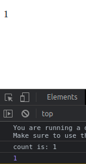
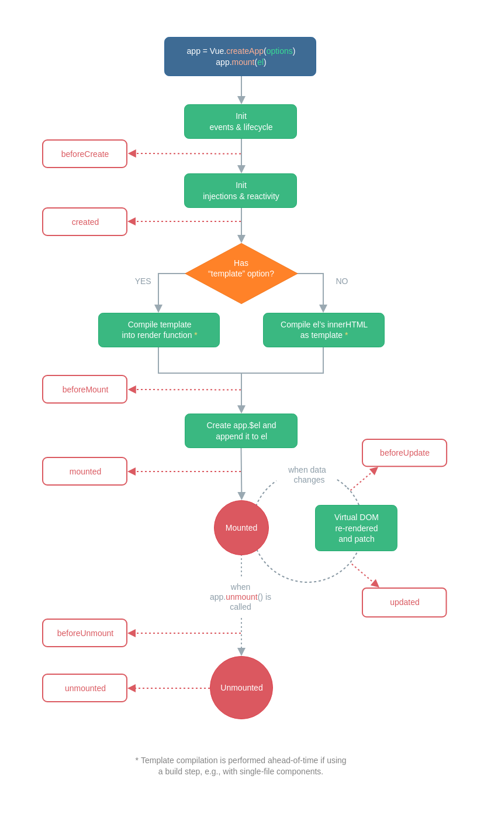

# Section 03: Application & Component Instances
## Lesson overview
- Creating an Application Instance
- The Root Component
- Component Instance Properties
- Lifecycle Hooks
- Lifecycle Diagram

## Creating an Application Instance
 - Every Vue application starts by creating a new application instance with the createApp function:
```vue
const app = Vue.createApp({
  /* options */
})
```
## The Root Component
- According to the tree diagram, the root is where the child comoponent is developed, so installing the root helps us to easily pass data between the child components in the Vue project.
```vue
<div id="app">
    <p>{{title}}</p>
</div>
```
```vue
const RootComponent = {
    data() {
        return {
            title: "Khoa Root"
        }
    }
}
const app = Vue.createApp(RootComponent).mount('#app')
```
- Result :


- Notes: `mount` does not return the application. Instead, it returns the root component instance
## Component Instance Properties
- Properties defined in data are exposed via the component instance:
```vue
const app = Vue.createApp({
  data() {
    return { count: 4 }
  }
})

const vm = app.mount('#app')

console.log(vm.count) // => 4
```
- Notes: There are various other component options that add user-defined properties to the component instance, such as methods, props, computed, inject and setup
## Lifecycle Hooks
- Component instance goes through a series of initialization steps when it's created - for example, it needs to set up data observation, compile the template, mount the instance to the DOM, and update the DOM when data changes
- it also runs functions called lifecycle hooks, giving users the opportunity to add their own code at specific stages.
```vue
Vue.createApp({
  data() {
    return { count: 1 }
  },
  created() {
    // `this` points to the vm instance
    console.log('count is: ' + this.count) // => "count is: 1"
  }
}
```
- Result:



- Notes: Don't use arrow function for it.
## Lifecycle Diagram
